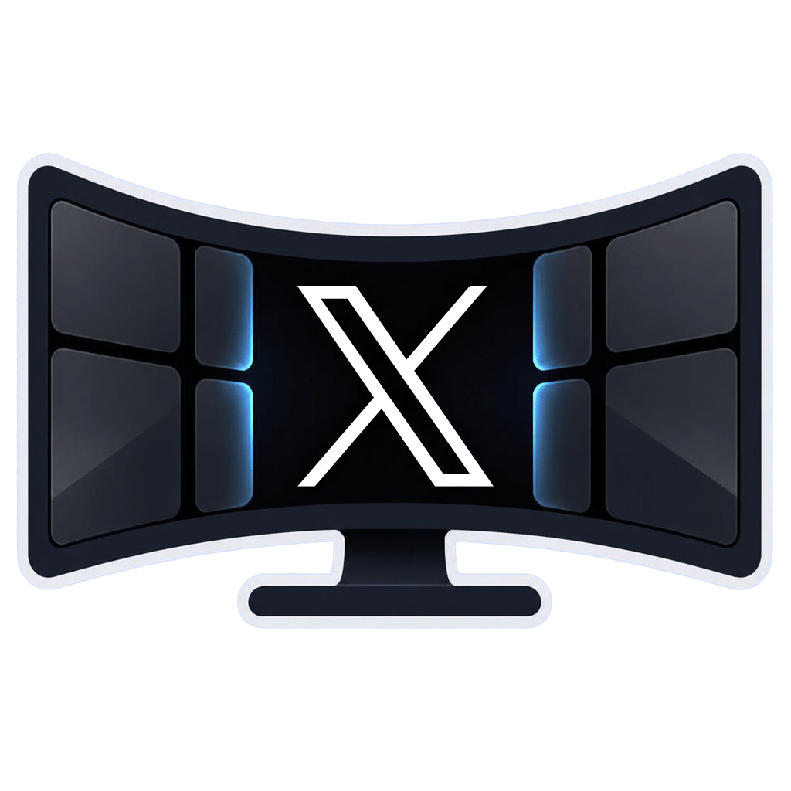

<p align="center">
  
</p>

<h1 align="center">X Ultrawide</h1>

<p align="center">
  A Chrome extension that turns X's thin timeline column into a full-screen masonry.<br />
  Scroll sideways or up and down, and hide ads.
</p>

<p align="center">
  
  
</p>

---

X shows your timeline in a narrow column and leaves the rest of a wide monitor empty. X Ultrawide
packs the posts into columns that use the whole screen.

## Features

- **Horizontal masonry (default):** screen-high columns that scroll sideways, with a draggable
  scrollbar along the bottom. Wheel and trackpad scrolling snap to columns.
- **Vertical masonry:** a classic multi-column layout that scrolls up and down.
- **Cleaner chrome:** an icon-only left menu, search in the top bar, and the composer and trends as the
  first two cards.
- **Ad blocking:** hides promoted and boosted posts, and promoted trends. Can be switched off.
- **Adjustable card width:** 320 to 900 px.
- **Light, dim and dark themes:** colors are read from the page.
- **Keeps your place:** open a post, a photo or a reply dialog and come back to the same spot.
- **Home feed only:** every other page is left exactly as X renders it.

## Install

**From the Chrome Web Store:** _link coming once the listing is published._

**From source** (any Chromium browser with extension support):

```
git clone <this repository>
cd x-ultrawide
npm run setup
npm run build
```

Then open `chrome://extensions`, turn on **Developer mode**, click **Load unpacked** and pick the
`build/` folder.

## Using it

Click the toolbar icon to open the popup:

| Setting | Values | Default |
| --- | --- | --- |
| On / off | on, off | on |
| Scrolling | horizontal, vertical | horizontal |
| Card width | 320 to 900 px | 520 |
| Block ads | on, off | on |

Changes apply to open X tabs immediately. Settings are stored with `chrome.storage.sync`.

## Development

Requirements: Node.js 20.19 or newer (22.12+ also works) and npm.

```
npm run setup      # install dependencies (root and ui/)
npm run build      # dev build into build/ (readable, with debug hooks)
npm run dev        # same, and rebuild scripts and CSS when src/ changes
npm run release    # minified build into dist/ and release/x-ultrawide-<version>.zip
npm run ui:dev     # popup only, as a live preview in a browser tab
```

Load `build/` unpacked and reload the extension after each rebuild. `npm run release` also checks
that no comment or debug hook survived minification, then zips `dist/` for the Chrome Web Store.

`ui:dev` needs one `npm run build` first, because that step generates the popup's logo.

### Project layout

```
src/
  page/         layout engine that runs inside X's page
  content/      settings bridge (chrome.storage -> page)
  styles/       CSS partials, bundled into content.css
  icons/icon.png  the one icon source; sizes are generated at build time
  manifest.json
ui/             popup (Vite, React, Tailwind, shadcn/ui)
scripts/        build.mjs, the pipeline
build/ dist/ release/   generated, not committed
```

Nothing the browser loads is hand-written: `page.js`, `content.js`, `content.css`, the manifest and
the popup are all produced by `scripts/build.mjs`.

### How it works

X renders the timeline with a virtualized list that mounts only the posts near the viewport and
positions them with absolute offsets. The extension:

1. Runs `page.js` in the page's own JavaScript world (`"world": "MAIN"`) so it can reach X's list
   instance. It supplies the list with a proxy viewport sized to the screen, so X keeps mounting posts
   as you scroll sideways.
2. Measures the mounted posts and packs them into columns (shortest-column masonry), moving each card
   with a CSS `translate`.
3. Handles scrolling itself (eased wheel input and column snapping in horizontal mode, native scrolling
   in vertical mode) and restores the position when you come back from a post.
4. Gates all styling on `html[data-xs-on]`, which is set only on the Home timeline (and the dialogs
   opened over it), so other pages are untouched.

`content.js` runs in the isolated world, reads `chrome.storage`, and passes the settings to `page.js`
through `localStorage` and a data attribute, so the first frame already has the right layout.

The release build is minified, not obfuscated (the Chrome Web Store rejects obfuscated code).

## Known limits

- It depends on X's current page structure and internal list implementation. When X changes its front
  end, parts of the layout can break until the extension is updated. Please open an issue with details.
- It only changes the Home timeline (the "For you" and "Following" style tabs). Profiles, search
  results, lists and bookmarks keep X's normal layout.
- Chrome and other Chromium browsers only.

## Privacy

No accounts, no analytics, no tracking, and no network requests of its own. Your settings stay in your
browser and in your own Chrome sync. The extension reads the posts already on the page only to lay
them out or, if you enable ad blocking, hide them. Nothing is stored or sent anywhere.

## Contributing

Issues and pull requests are welcome. For a layout bug, include your screen size, the card width, the
scroll mode, and what you were doing. Before opening a pull request, run `npm run build` and
`npm run release` and make sure both finish without errors.

## Disclaimer

X Ultrawide is an independent project. It is not affiliated with, endorsed by or sponsored by X Corp.
"X" is a trademark of its respective owner.

## License

[MIT](LICENSE)
